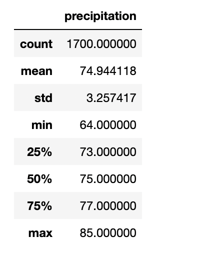
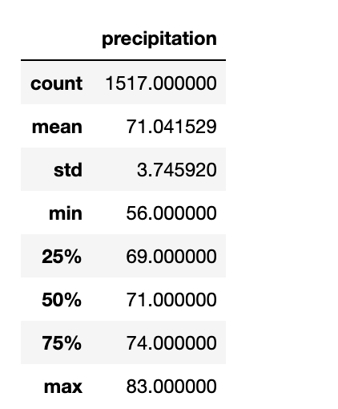

# Temperature Trends in Oahu for June and December

## Overview
The current project is designed to provide insight into recent trends in temperature on the island of Oahu. June and December are chosen to provide a snapshot of the climate at two very different times of year. We are trying to determine if the climate is likely to support a successful ice cream shop business throughout the year. 
The available database contains temperature observations in Oahu from June 2010-2017 and December 2010-2016.

## Results

- The mean temperature in June has been 74.9° F (± 3.3°).
- The mean temperature in December is 71.0° F (± 3.7°).
- The minimum temperature in December was 56° while in June it was 64°.

### June Summary

### December Summary

## Summary

Oahu is somewhat warmer in June compared to December, with an average temperature of 75 compared to 71. There is also a little bit more variability in December compared to June, reflected in the larger standard deviation. This appears to be driven by some substantially lower temperatures in December, given there is such a large difference in the minimum temperature.
The data included here do cover 8 and 7 years for June and December, respectively. It would be useful to look at this information across the years to see if there have been any trends across the different years. Climate change could have caused an overall warming trend, with the most recent temperatures being warmer than earlier ones. 
Precipitation data is also available. When it comes to eating ice cream, even with warmer temperatures rain is likely to discourage individuals from making purchases. I would look at the average cumulative precipitation for each month.
The temperature observations wouldn't discourage an investment in an ice cream shop on Oahu. It looks as though there is a consistent pleasant temperature throughout the year.
